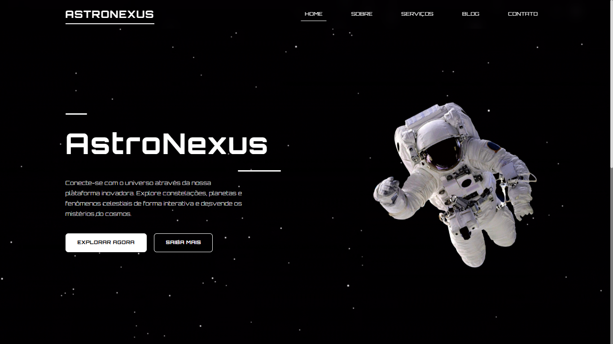

# 🌌 AstroNexus

## 📌 Sobre o Projeto

**AstroNexus** é um site dedicado à astronomia que oferece uma experiência imersiva sobre o universo. A plataforma disponibiliza fatos curiosos, artigos educativos, blogs especializados e conteúdo sobre descobertas espaciais, tornando o conhecimento astronômico acessível e envolvente para entusiastas de todas as idades.

Este projeto foi desenvolvido como parte da disciplina **Linguagem Script** do curso **Sistemas para Internet** no **IFPB**, em colaboração entre:  
👨‍💻 [Igor](https://github.com/Igor-AI-Coder)  
👨‍💻 [Emanoel](https://github.com/maneuu)  
👨‍💻 [Eduardo](https://github.com/LuisEduardox)

## 🎨 Preview do Site

## 🌐 Acesse o Projeto

🚀 **[Ver Site Online](https://igor-ai-coder.github.io/AstroNexus/)**
