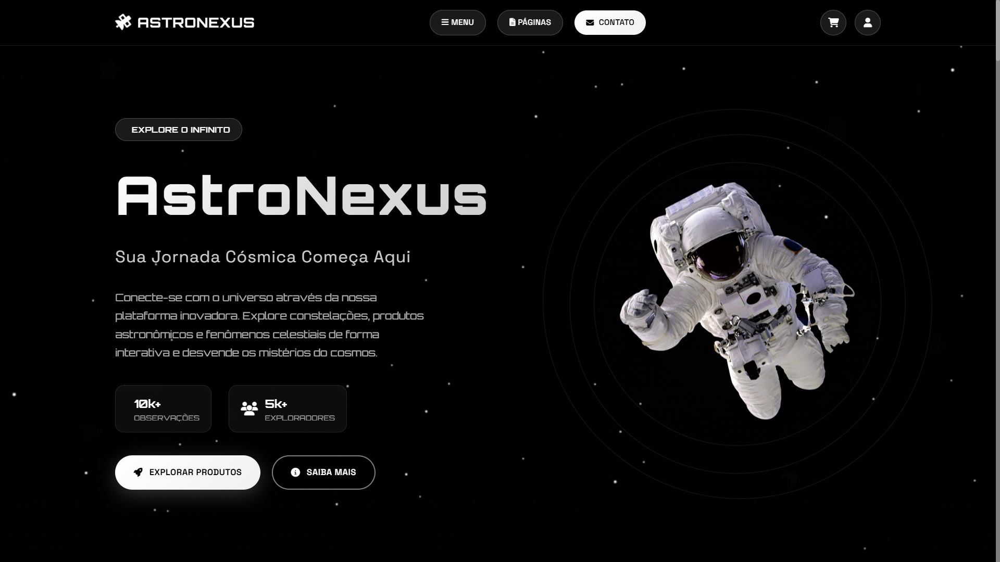

# 🌌 AstroNexus

[](https://developer.mozilla.org/pt-BR/docs/Web/HTML)
[](https://developer.mozilla.org/pt-BR/docs/Web/CSS)
[](https://developer.mozilla.org/pt-BR/docs/Web/JavaScript)

## 📌 Sobre o Projeto

**AstroNexus** é um site dedicado à astronomia que oferece uma experiência imersiva sobre o universo. A plataforma disponibiliza fatos curiosos, artigos educativos, blogs especializados e conteúdo sobre descobertas espaciais, tornando o conhecimento astronômico acessível e envolvente para entusiastas de todas as idades.

Este projeto foi desenvolvido como parte da disciplina **Linguagem Script** do curso **Sistemas para Internet** no **IFPB**, em colaboração entre:  
👨‍💻 [Igor](https://github.com/Igor-AI-Coder)  
👨‍💻 [Emanoel](https://github.com/maneuu)  
👨‍💻 [Eduardo](https://github.com/LuisEduardox)

## 🎨 Preview do Site



## 🌐 Acesse o Projeto

🚀 **[Ver Site Online](https://igor-ai-coder.github.io/AstroNexus/)**

## 🛠️ Como instalar e executar o projeto

1. **Clone o repositório:**
   ```sh
   git clone https://github.com/Igor-AI-Coder/AstroNexus.git
   ```
2. **Navegue até o diretório do projeto:**
   ```sh
   cd AstroNexus
   ```
3. **Instale as dependências:**
   ```sh
   npm install
   ```
4. **Execute o projeto em modo de desenvolvimento:**
   ```sh
   npm run dev
   ```
   Ou, para visualizar uma prévia de produção, primeiro gere o build:
   ```sh
   npm run build
   ```
   E então execute:
   ```sh
   npm run preview
   ```

5. **Abra o navegador e acesse o endereço exibido no terminal** (geralmente `http://localhost:5173`).

Agora você pode explorar o projeto localmente! 🌌
